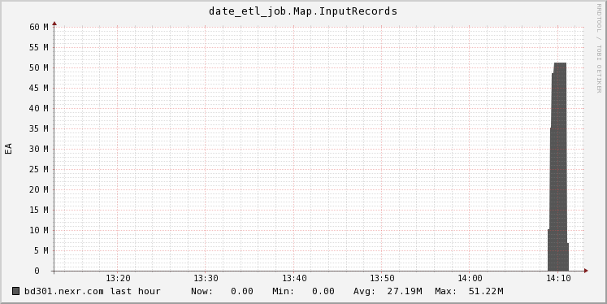
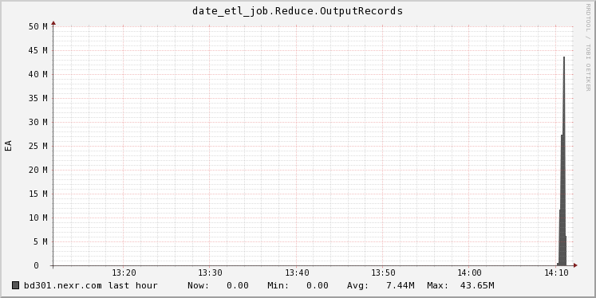
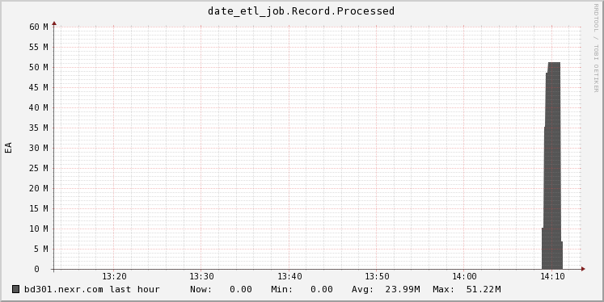
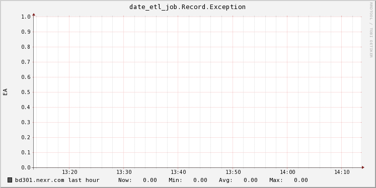

How to metric report to ganglia
===============================

# Introduction

Metrics of Morphlines-mr can be provided to Ganglia. Just specify the ganglia server's address with `-g` option for metric report. 
If the address is multicast IP, Morphlines-mr sets multicast-mode automatically. Also the address contains port number with ':' separator. Default port # is 8649.

# Examples

```
yarn jar morphline-mr-0.1-jar-with-dependencies.jar --files conf/morphline_with_exception.conf  -f morphline_with_exception.conf -m morphline1 -i /user/root/syslog/messages -o /user/root/syslog/output2 -r -g ganglia.server.com:8649
```

or

```
yarn jar morphline-mr-0.1-jar-with-dependencies.jar --files conf/morphline_with_exception.conf  -f morphline_with_exception.conf -m morphline1 -i /user/root/syslog/messages -o /user/root/syslog/output2 -r -g ganglia.server.com
```

or in case of multicase mode

```
yarn jar morphline-mr-0.1-jar-with-dependencies.jar --files conf/morphline_with_exception.conf  -f morphline_with_exception.conf -m morphline1 -i /user/root/syslog/messages -o /user/root/syslog/output2 -r -g 239.2.11.71
```

# Metrics

The reported metrics can be found under the `morphlies-mr` group, in the job client node. The metrics are divided into job's name. One job has metrics:

* Map.InputRecords: Total number of map input records.
* Reduce.OutputRecords: Total number of reduce output records.
* Record.Processed: Total number of normal records.
* Record.Exception: Total number of exception records.

Following images are samples of Ganglia reports.

* Map.InputRecords


* Reduce.OutputRecords


* Record.Processed


* Record.Exception


# Want more metrics...

Modify `gangliaMetric()` method or `monitorAndPrintJob()` method in the `MorphlinesJob` class. Add more `ganglia.announce()` line as much as want.
Just use 'morphlines-mr' group and `jobname.Something` name for gathered metric graphs and easy search.